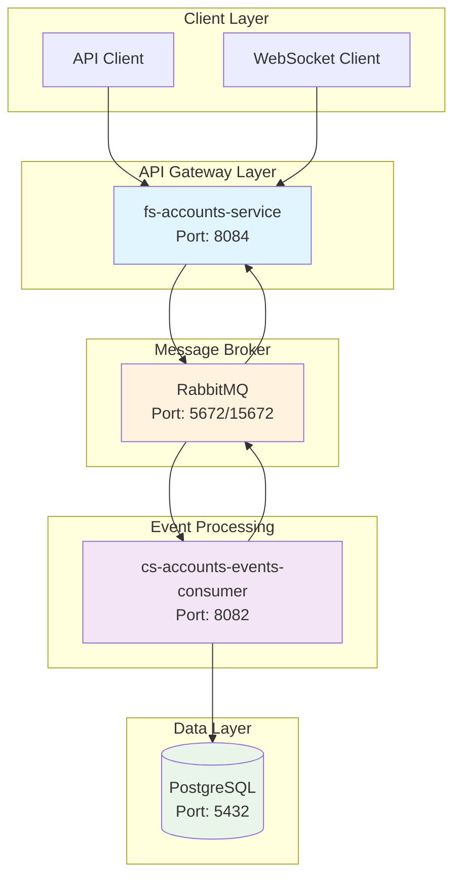
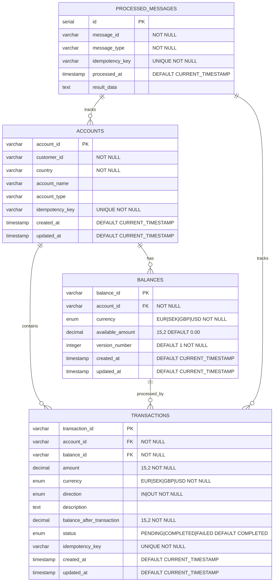
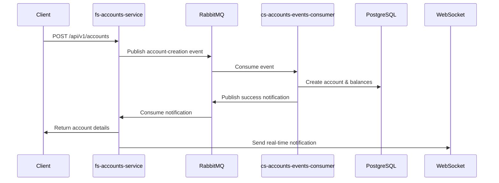
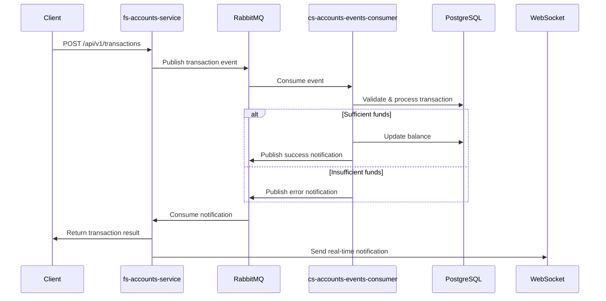

# Tuum Core Banking System

This project is a **microservices-based core banking platform** designed to handle **account management** and **transaction processing** using an **event-driven architecture**. It is built with scalability, modularity, and eventual consistency in mind.

- Follows **CQRS (Command Query Responsibility Segregation)**:
  - **Queries**: Direct DB access for low-latency reads.
  - **Commands**: Handled asynchronously via event publishing.
- Built on a **semi-asynchronous architecture**:
  - In a production-grade, fully async setup, commands would be fire-and-forget.
  - In this implementation, some API calls **wait for completion notifications** before responding, to satisfy specific requirements.
- **RabbitMQ** is used as the message broker.
- Event publishing and response flow:
  - Commands are published to `{entity}-create-queue`.
  - Notifications or errors are received via `{entity}-notification-queue` or `{entity}-error-queue`.
- A custom RabbitMQ listener:

  - Listens for completion notifications.
  - Completes the original request by processing the response.
  - Designed to optionally notify clients via callback endpoints in future enhancements.

- **Common Issues**

  - Service won't start
  - Database connection issues
  - RabbitMQ connection issues: for liner
  - common library is not compiling well
  - cleaning the code

- **Future-enactments**
 - Exception handling should be better 
 - using design pattern
 - loggin 
 - full ASYNC processing

- ** Development Machine Performance for transcription endpoint **

* Concurrent Test (5 requests): 5.0 requests/second
* Average Response Time: 0.089 seconds ~89 milliseconds.
* If each request takes 0.089s and they’re handled in parallel (concurrent), the system can handle 1/ 0.089s ≈11.24 requests/s

## System Architecture



## System Components

| Component                       | Port  | URL                                                  | Description                                                  | Technology             |
| ------------------------------- | ----- | ---------------------------------------------------- | ------------------------------------------------------------ | ---------------------- |
| **fs-accounts-service**         | 8084  | http://localhost:8084                                | Main REST API service for account and transaction management | Spring Boot, WebSocket |
| **cs-accounts-events-consumer** | 8082  | http://localhost:8082                                | Event consumer for processing account and transaction events | Spring Boot, MyBatis   |
| **PostgreSQL Database**         | 5432  | -                                                    | Primary database for accounts, balances, and transactions    | PostgreSQL 15          |
| **RabbitMQ AMQP**               | 5672  | -                                                    | Message broker for event-driven communication                | RabbitMQ 3.13.7        |
| **RabbitMQ Management**         | 15672 | http://localhost:15672                               | Web UI for RabbitMQ monitoring and management                | RabbitMQ Management    |
| **Swagger UI**                  | 8083  | http://localhost:8083/api/v1/swagger-ui/index.html#/ | API documentation and testing interface                      | SpringDoc OpenAPI      |

## Quick Start

### Prerequisites

- **Java 17** or higher
- **Docker** and **Docker Compose**

### Environment Setup

1. **How To start the project locally**
   ```bash
    docker-compose up postgres rabbitmq -d
    ./gradlew :fs-accounts-service:build
    ./gradlew :cs-accounts-events-consumer:build
    ./gradlew :common-lib:build
    ./gradlew :fs-accounts-service:bootRun
    ./gradlew :cs-accounts-events-consumer:bootRun
   ```
1. **How To start the project on docker**
   ```bash
    docker-compose up -d
    ./gradlew :fs-accounts-service:build
    ./gradlew :cs-accounts-events-consumer:build
    ./gradlew :common-lib:build
    ./gradlew :fs-accounts-service:bootRun
    ./gradlew :cs-accounts-events-consumer:bootRun
   ```

### Database Configuration

The system uses PostgreSQL with the following default settings:

- **Database**: `tuum_banking`
- **Username**: `tuum_user`
- **Password**: `tuum_password`
- **Host**: `localhost`
- **Port**: `5432`

### RabbitMQ Configuration

RabbitMQ is configured with:

- **Management UI**: http://localhost:15672
- **Username**: `tuum_user`
- **Password**: `tuum_password`
- **Virtual Host**: `/`

## Database Schema

### Relationships



### Database Indexes

| Index Name                          | Table                | Columns       | Purpose                             |
| ----------------------------------- | -------------------- | ------------- | ----------------------------------- |
| `idx_accounts_customer_id`          | `accounts`           | `customer_id` | Fast customer account lookup        |
| `idx_balances_account_id`           | `balances`           | `account_id`  | Fast balance lookup by account      |
| `idx_transactions_account_id`       | `transactions`       | `account_id`  | Fast transaction lookup by account  |
| `idx_transactions_created_at`       | `transactions`       | `created_at`  | Time-based transaction queries      |
| `idx_processed_messages_message_id` | `processed_messages` | `message_id`  | Fast message lookup for idempotency |

### Key Features

- **Multi-currency Support**: EUR, SEK, GBP, USD
- **Optimistic Locking**: Version numbers on balances for concurrency control
- **Idempotency**: Unique idempotency keys prevent duplicate processing
- **Audit Trail**: Created/updated timestamps on all tables
- **Cascade Deletes**: Account deletion cascades to balances and transactions
- **Message Tracking**: Processed messages table for event sourcing

## 🔄 Event Flow

### Account Creation Flow



### Transaction Processing Flow



### Building and Testing

```bash
# Build all modules
./gradlew clean build

# Run tests
./gradlew test

# Build specific module
./gradlew :fs-accounts-service:build
./gradlew :cs-accounts-events-consumer:build

# Run with specific profile
./gradlew :fs-accounts-service:bootRun --args='--spring.profiles.active=dev'
```

```bash
# View all service logs
docker-compose logs -f

# View specific service logs
docker-compose logs -f fs-accounts-service
docker-compose logs -f cs-accounts-events-consumer

# View infrastructure logs
docker-compose logs -f postgres
docker-compose logs -f rabbitmq
```


### Key Endpoints

#### Account Management

- `POST /api/v1/accounts` - Create new account
- `GET /api/v1/accounts/{id}` - Get account details
- `GET /api/v1/accounts/{id}/balances` - Get account balances

#### Transaction Management

- `POST /api/v1/transactions` - Create new transaction
- `GET /api/v1/transactions/{id}` - Get transaction details
- `GET /api/v1/accounts/{id}/transactions` - Get account transactions

#### Health & Monitoring

- `GET /actuator/health` - Service health check
- `GET /actuator/info` - Service information

### Database Operations

```bash
# Connect to PostgreSQL
docker exec -it tuum-postgres psql -U tuum_user -d tuum_banking

# List all tables
docker exec tuum-postgres psql -U tuum_user -d tuum_banking -c "\dt"

# Query accounts
docker exec tuum-postgres psql -U tuum_user -d tuum_banking -c "SELECT * FROM accounts;"

# Query transactions
docker exec tuum-postgres psql -U tuum_user -d tuum_banking -c "SELECT * FROM transactions;"

# Query processed messages
docker exec tuum-postgres psql -U tuum_user -d tuum_banking -c "SELECT * FROM processed_messages;"
```

### RabbitMQ Management

- **Management UI**: http://localhost:15672
- **Username**: `tuum_user`
- **Password**: `tuum_password`

```bash
# List queues
curl -s -u tuum_user:tuum_password http://localhost:15672/api/queues | jq '.[].name'

# Get queue details
curl -s -u tuum_user:tuum_password http://localhost:15672/api/queues/%2F/account-events-queue
```


## System Architecture Overview


