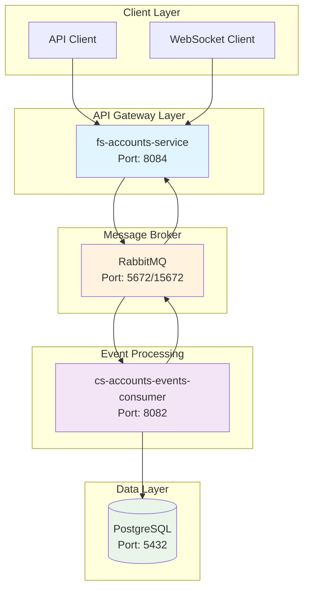
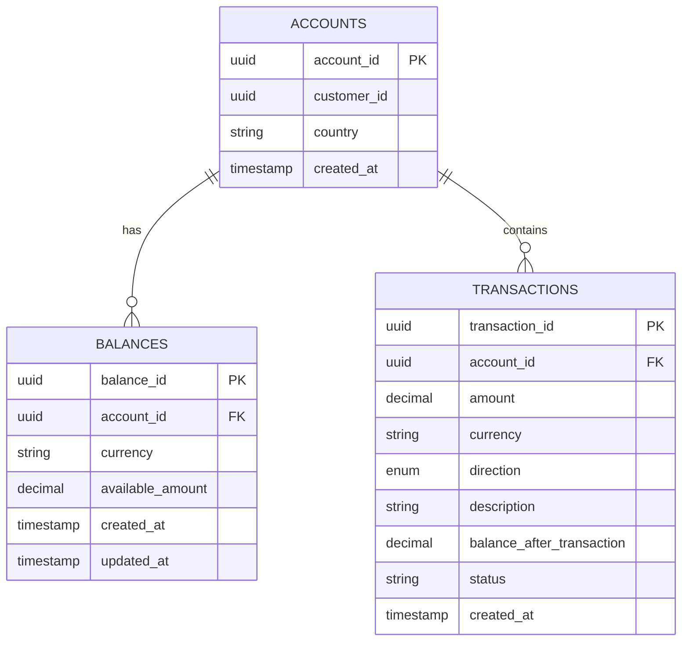
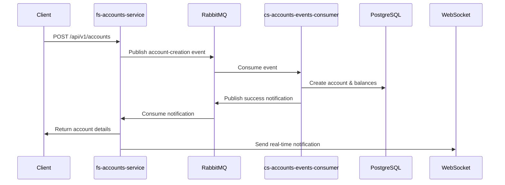
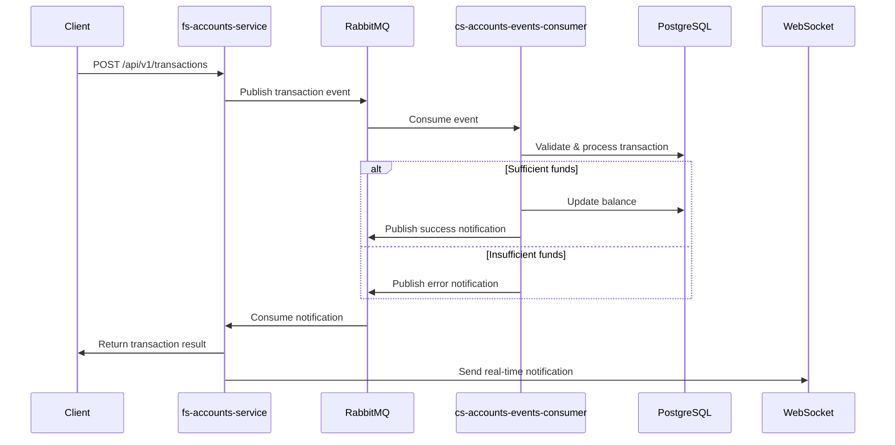

# Tuum Core Banking System

A microservices-based core banking system built with Spring Boot, featuring event-driven architecture, real-time notifications, and robust transaction processing.

## 🏗️ System Architecture



## 📋 System Components

| Component | Port | URL | Description | Technology |
|-----------|------|-----|-------------|------------|
| **fs-accounts-service** | 8084 | http://localhost:8084 | Main REST API service for account and transaction management | Spring Boot, WebSocket |
| **cs-accounts-events-consumer** | 8082 | http://localhost:8082 | Event consumer for processing account and transaction events | Spring Boot, MyBatis |
| **PostgreSQL Database** | 5432 | - | Primary database for accounts, balances, and transactions | PostgreSQL 15 |
| **RabbitMQ AMQP** | 5672 | - | Message broker for event-driven communication | RabbitMQ 3.13.7 |
| **RabbitMQ Management** | 15672 | http://localhost:15672 | Web UI for RabbitMQ monitoring and management | RabbitMQ Management |
| **Swagger UI** | 8084 | http://localhost:8084/swagger-ui.html | API documentation and testing interface | SpringDoc OpenAPI |

## 🚀 Quick Start

### Prerequisites

- **Java 17** or higher
- **Docker** and **Docker Compose**
- **Gradle 8.5** (or use the included wrapper)
- **Git**

### Environment Setup

1. **Clone the repository:**
   ```bash
   git clone <repository-url>
   cd tuum-core-banking
   ```

2. **Verify Java version:**
   ```bash
   java -version
   # Should show Java 17 or higher
   ```

3. **Check Docker:**
   ```bash
   docker --version
   docker-compose --version
   ```

### Option 1: Docker Compose (Recommended)

Start all services with a single command:

```bash
# Build and start all services
docker-compose up -d

# View logs
docker-compose logs -f

# Stop all services
docker-compose down
```

### Option 2: Local Development

1. **Start infrastructure services:**
   ```bash
   docker-compose up -d postgres rabbitmq
   ```

2. **Build the project:**
   ```bash
   ./gradlew clean build
   ```

3. **Run services in separate terminals:**
   ```bash
   # Terminal 1 - Main service
   ./gradlew :fs-accounts-service:bootRun
   
   # Terminal 2 - Event consumer
   ./gradlew :cs-accounts-events-consumer:bootRun
   ```

## 🔧 Configuration

### Environment Variables

| Variable | Default | Description |
|----------|---------|-------------|
| `SPRING_PROFILES_ACTIVE` | `default` | Spring profile to use |
| `DB_HOST` | `localhost` | PostgreSQL host |
| `DB_PORT` | `5432` | PostgreSQL port |
| `DB_NAME` | `tuum_banking` | Database name |
| `DB_USER` | `tuum_user` | Database username |
| `DB_PASSWORD` | `tuum_password` | Database password |
| `RABBITMQ_HOST` | `localhost` | RabbitMQ host |
| `RABBITMQ_PORT` | `5672` | RabbitMQ AMQP port |
| `RABBITMQ_USER` | `tuum_user` | RabbitMQ username |
| `RABBITMQ_PASSWORD` | `tuum_password` | RabbitMQ password |

### Database Configuration

The system uses PostgreSQL with the following default settings:
- **Database**: `tuum_banking`
- **Username**: `tuum_user`
- **Password**: `tuum_password`
- **Host**: `localhost`
- **Port**: `5432`

### RabbitMQ Configuration

RabbitMQ is configured with:
- **Management UI**: http://localhost:15672
- **Username**: `tuum_user`
- **Password**: `tuum_password`
- **Virtual Host**: `/`

## 📊 Database Schema

### Core Tables

| Table | Description | Key Fields |
|-------|-------------|------------|
| `accounts` | Account information | `account_id`, `customer_id`, `country` |
| `balances` | Account balances by currency | `balance_id`, `account_id`, `currency`, `available_amount` |
| `transactions` | Transaction records | `transaction_id`, `account_id`, `amount`, `currency`, `direction` |
| `processed_messages` | Message deduplication | `message_id`, `processed_at` |

### Relationships



## 🔄 Event Flow

### Account Creation Flow



### Transaction Processing Flow




### Building and Testing

```bash
# Build all modules
./gradlew clean build

# Run tests
./gradlew test

# Build specific module
./gradlew :fs-accounts-service:build
./gradlew :cs-accounts-events-consumer:build

# Run with specific profile
./gradlew :fs-accounts-service:bootRun --args='--spring.profiles.active=dev'
```

## 📡 API Documentation

### Swagger UI
- **URL**: http://localhost:8084/swagger-ui.html
- **OpenAPI Spec**: http://localhost:8084/api-docs

### Key Endpoints

#### Account Management
- `POST /api/v1/accounts` - Create new account
- `GET /api/v1/accounts/{id}` - Get account details
- `GET /api/v1/accounts/{id}/balances` - Get account balances

#### Transaction Management
- `POST /api/v1/transactions` - Create new transaction
- `GET /api/v1/transactions/{id}` - Get transaction details
- `GET /api/v1/accounts/{id}/transactions` - Get account transactions

#### Health & Monitoring
- `GET /actuator/health` - Service health check
- `GET /actuator/info` - Service information


### Database Operations

```bash
# Connect to PostgreSQL
docker exec -it tuum-postgres psql -U tuum_user -d tuum_banking

# List all tables
docker exec tuum-postgres psql -U tuum_user -d tuum_banking -c "\dt"

# Query accounts
docker exec tuum-postgres psql -U tuum_user -d tuum_banking -c "SELECT * FROM accounts;"

# Query transactions
docker exec tuum-postgres psql -U tuum_user -d tuum_banking -c "SELECT * FROM transactions;"

# Query processed messages
docker exec tuum-postgres psql -U tuum_user -d tuum_banking -c "SELECT * FROM processed_messages;"
```

### RabbitMQ Management

- **Management UI**: http://localhost:15672
- **Username**: `tuum_user`
- **Password**: `tuum_password`

```bash
# List queues
curl -s -u tuum_user:tuum_password http://localhost:15672/api/queues | jq '.[].name'

# Get queue details
curl -s -u tuum_user:tuum_password http://localhost:15672/api/queues/%2F/account-events-queue
```

## 🚨 Troubleshooting

### Common Issues

1. **Service won't start:**
   - Check if ports are available
   - Verify Docker containers are running
   - Check application logs

2. **Database connection issues:**
   - Ensure PostgreSQL container is running
   - Verify database credentials
   - Check network connectivity

3. **RabbitMQ connection issues:**
   - Ensure RabbitMQ container is running
   - Verify queue and exchange configuration
   - Check message routing

4. **Event processing failures:**
   - Check consumer logs
   - Verify message format
   - Check database constraints

### Logs

```bash
# View all service logs
docker-compose logs -f

# View specific service logs
docker-compose logs -f fs-accounts-service
docker-compose logs -f cs-accounts-events-consumer

# View infrastructure logs
docker-compose logs -f postgres
docker-compose logs -f rabbitmq
```


