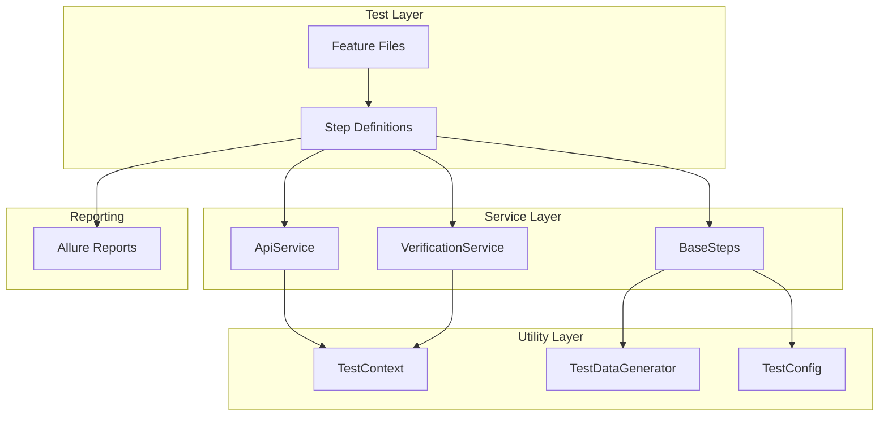

# Acceptance Test Framework

A comprehensive, SOLID-principle-based acceptance test framework for the Tuum Core Banking System using Cucumber, JUnit, RestAssured, and Allure reporting.

## 🏗️ Architecture Overview

The test framework follows **SOLID principles** and is designed for **maximum reusability** and **maintainability**:



## 🎯 SOLID Principles Implementation

### 1. **Single Responsibility Principle (SRP)**

- **BaseSteps**: Common functionality and utilities
- **ApiService**: All API operations
- **VerificationService**: All verification logic
- **TestDataGenerator**: Data generation utilities
- **TestContext**: Test state management

### 2. **Open/Closed Principle (OCP)**

- Services are open for extension but closed for modification
- New API endpoints can be added without changing existing code
- New verification methods can be added without modifying existing ones

### 3. **Liskov Substitution Principle (LSP)**

- All step definitions extend BaseSteps
- Services use interfaces and inheritance properly
- Polymorphic behavior is maintained

### 4. **Interface Segregation Principle (ISP)**

- Services have focused, specific responsibilities
- No forced dependencies on unused methods
- Clean separation of concerns

### 5. **Dependency Inversion Principle (DIP)**

- High-level modules (steps) depend on abstractions (services)
- Low-level modules (services) implement abstractions
- Dependency injection through service instances

## 📁 Project Structure

```
acceptance-test/
├── src/
│   ├── main/
│   │   └── java/
│   │       └── com/tuum/acceptancetest/
│   │           ├── config/
│   │           │   └── TestConfig.java          # Test configuration
│   │           ├── service/
│   │           │   ├── ApiService.java          # Generic API operations
│   │           │   └── VerificationService.java # Generic verification logic
│   │           ├── steps/
│   │           │   ├── BaseSteps.java           # Common step functionality
│   │           │   ├── AccountManagementSteps.java
│   │           │   └── TransactionProcessingSteps.java
│   │           └── utils/
│   │               ├── TestContext.java         # Test state management
│   │               └── TestDataGenerator.java   # Data generation utilities
│   └── test/
│       ├── java/
│       │   └── com/tuum/acceptancetest/
│       │       └── features/
│       │           ├── AcceptanceTestRunner.java
│       │           └── CucumberTest.java
│       └── resources/
│           ├── features/
│           │   ├── account_management.feature
│           │   └── transaction_processing.feature
│           ├── allure.properties
│           └── logback-test.xml
├── build.gradle
└── README.md
```

## 🔧 Key Components

### 1. **BaseSteps** - Foundation Class

```java
public abstract class BaseSteps {
    // Common setup and utilities
    protected void verifySystemHealth()
    protected Map<String, String> extractDataFromTable(DataTable dataTable)
    protected String resolveDynamicValue(String value, String contextKey)
    protected Response makeHttpRequest(String method, String endpoint, String requestBody, Map<String, String> headers)
    protected void verifyResponseStatus(Response response, int expectedStatus, String operation)
    // ... more generic methods
}
```

### 2. **ApiService** - Generic API Operations

```java
public class ApiService {
    // Account operations
    public Response createAccount(String customerId, String country, String[] currencies)
    public Response getAccount(String accountId)
    public Response createAccountWithBalance(String customerId, String country, String currency, double initialBalance)

    // Transaction operations
    public Response createTransaction(String accountId, double amount, String currency, String direction, String description)
    public Response getTransaction(String transactionId)
    public Response getAccountTransactions(String accountId)

    // Generic operations
    public Response makeRequest(String method, String endpoint, String requestBody, Map<String, String> headers)
    public void createMultipleTransactions(String accountId, int count, double baseAmount, String currency)
}
```

### 3. **VerificationService** - Generic Verification Logic

```java
public class VerificationService {
    // Generic verifications
    public void verifyResponseStatus(Response response, int expectedStatus, String operation)
    public void verifyResponseFields(Response response, Map<String, Object> expectedFields, String operation)

    // Account verifications
    public void verifyAccountCreation(Response response)
    public void verifyAccountBalance(Response response, String currency, double expectedAmount)
    public void verifyAccountInformation(Response response)

    // Transaction verifications
    public void verifyTransactionCreation(Response response)
    public void verifyTransactionInformation(Response response)
    public void verifyTransactionList(Response response)

    // Balance verifications
    public void verifyBalanceUpdate(Response response, String currency, double transactionAmount, String direction)
    public void verifyAllCurrencyBalances(Response response)
}
```

## 🚀 Usage Examples

### 1. **Data-Driven Testing with Cucumber Tables**

```gherkin
Scenario Outline: Create accounts with different currencies
  Given the banking system is running
  And I have a unique customer ID
  And I want to create a new account with the following details:
    | customerId | country | currencies |
    | <customerId> | EE     | EUR,USD,SEK |
  When I send a request to create the account
  Then the account should be created successfully
  And the account should have the following balances initialized:
    | currency | expectedAmount |
    | <currencies> | 0.00        |
```

### 2. **Reusable Step Definitions**

```java
@Given("I have an existing account with sufficient balance")
@Step("Create account with sufficient balance for transactions")
public void iHaveAnExistingAccountWithSufficientBalance() {
    if (!TestContext.containsKey("accountId")) {
        String customerId = TestDataGenerator.generateUniqueCustomerId();
        response = apiService.createAccountWithBalance(customerId, "EE", "EUR", 1000.00);
        verificationService.verifyAccountCreation(response);
        // ... setup context
    }
}
```

### 3. **Generic API Operations**

```java
// Create account with any currencies
Response response = apiService.createAccount("CUST123", "EE", new String[]{"EUR", "USD"});

// Create transaction with any parameters
Response txnResponse = apiService.createTransaction("ACC123", 100.50, "EUR", "IN", "Test transaction");

// Generic HTTP request
Response customResponse = apiService.makeRequest("POST", "/custom/endpoint", requestBody, headers);
```

## 🎨 Benefits of the SOLID Design

### 1. **Reusability**

- **Generic Services**: ApiService and VerificationService can be used across different test scenarios
- **Common Steps**: BaseSteps provides reusable functionality for all step definitions
- **Data Tables**: Cucumber data tables enable testing multiple scenarios with the same step definitions

### 2. **Maintainability**

- **Single Source of Truth**: Each service has a single responsibility
- **Easy Updates**: Changes to API endpoints only require updates in ApiService
- **Clear Separation**: Verification logic is separate from API operations

### 3. **Extensibility**

- **New Endpoints**: Add new methods to ApiService without changing existing code
- **New Verifications**: Add new verification methods to VerificationService
- **New Features**: Create new step definitions that extend BaseSteps

### 4. **Testability**

- **Isolated Components**: Each service can be tested independently
- **Mock Support**: Services can be easily mocked for unit testing
- **Clear Dependencies**: Dependencies are explicit and manageable

## 📊 Allure Reporting Integration

The framework includes comprehensive Allure reporting:

```java
@Step("Verify account creation success")
public void theAccountShouldBeCreatedSuccessfully() {
    verificationService.verifyAccountCreation(response);
    // Allure automatically captures step details, attachments, and descriptions
}
```

### Allure Features:

- **Step Descriptions**: Each step has a clear description
- **Request/Response Attachments**: All HTTP requests and responses are captured
- **Test Data Attachments**: Data tables and generated data are attached
- **Verification Details**: All verification results are documented
- **Error Context**: Detailed error information for failed tests

## 🧪 Running Tests

### 1. **Run All Tests**

```bash
./gradlew :acceptance-test:test
```

### 2. **Run Specific Feature**

```bash
./gradlew :acceptance-test:test --tests "*AccountManagement*"
```

### 3. **Generate Allure Report**

```bash
./gradlew :acceptance-test:allureReport
./gradlew :acceptance-test:allureServe
```

### 4. **Run with Specific Tags**

```bash
./gradlew :acceptance-test:test -Dcucumber.filter.tags="@smoke"
```

## 🔄 Data-Driven Testing Patterns

### 1. **Scenario Outlines**

```gherkin
Scenario Outline: Test multiple currencies
  Given I want to create a new account with exact payload:
    | customerId | country | currencies |
    | <customerId> | <country> | <currencies> |
  When I send a request to create the account
  Then the account should be created successfully

  Examples:
    | customerId | country | currencies |
    | CUST001    | EE      | EUR        |
    | CUST002    | SE      | SEK        |
    | CUST003    | GB      | GBP        |
```

### 2. **Dynamic Value Resolution**

```java
// In step definition
String customerId = resolveDynamicValue(accountData.get("customerId"), "customerId");
// Supports <customerId> syntax for dynamic values
```

### 3. **Context-Aware Testing**

```java
// TestContext manages state across steps
TestContext.setValue("accountId", accountId);
String accountId = TestContext.getStringValue("accountId");
```

## 🛠️ Best Practices

### 1. **Step Definition Guidelines**

- Extend `BaseSteps` for common functionality
- Use `@Step` annotations for Allure integration
- Keep steps focused and single-purpose
- Use descriptive step names

### 2. **Service Usage**

- Use `ApiService.getInstance()` for API operations
- Use `VerificationService.getInstance()` for verifications
- Leverage generic methods for common operations

### 3. **Data Management**

- Use `TestDataGenerator` for unique data
- Store test state in `TestContext`
- Use data tables for parameterized testing

### 4. **Error Handling**

- Services include comprehensive error handling
- Allure captures detailed error information
- Failures include context and expected vs actual values

## 🔮 Future Enhancements

### 1. **Parallel Execution**

- Framework is designed to support parallel test execution
- Thread-safe TestContext implementation
- Isolated test data generation

### 2. **API Versioning**

- ApiService can be extended to support multiple API versions
- Version-specific verification methods
- Backward compatibility support

### 3. **Custom Assertions**

- Extend VerificationService with domain-specific assertions
- Custom matchers for business rules
- Performance assertions

### 4. **Integration with CI/CD**

- Allure reports integration with CI systems
- Test result notifications
- Automated test execution

This framework provides a solid foundation for acceptance testing that is maintainable, extensible, and follows industry best practices.
